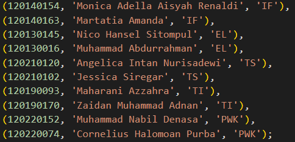
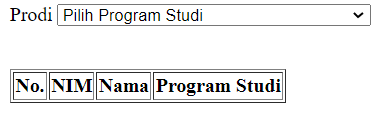
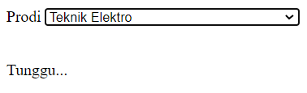
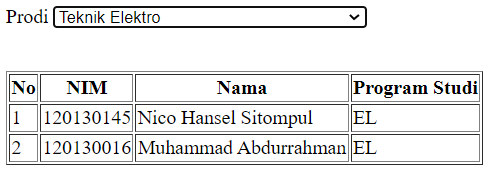

# Pertemuan 5
Tugas Praktikum Pemrogram Website RB 
Jadwal A 
Pertemuan 5

Nama: Monica Adella Aisyah Renaldi
NIM : 120140144

1. Tahap awal membuat aplikasi web yang menampilkan data mahasiswa pada saat pengguna melakukan perubahan dari pilihan program studi yang sudah tersedia menggunakan bantuan AJAX.
2. Menggunakan aplikasi yang terhubung ke database yang terdapat tabel mahasiswa dengan menggunkan 3 data yaitu Nama, NIM, dan Program Studi.
3. Dalam aplikasi terdapat 10 baris data mahasiswa.

Berikut ini merupakan hasil dari tugas yang telah dikerjakan

Data Tabel

Pada data tabel membuat 10 data mahasiswa

AWAL DIJALANKAN

Saat pertama kali dijalankan data akan terlihat masih kosong, karena belum memilih *option* yang ada

PROSES LOADING

Pada tampilan ini buat agar pergantian data yang dipilih akan terlihat dengan jelas

HASIL AKHIR

Pada saat sata yang terlihat akan sesuai dengan yang dipilih yang ditentukan

